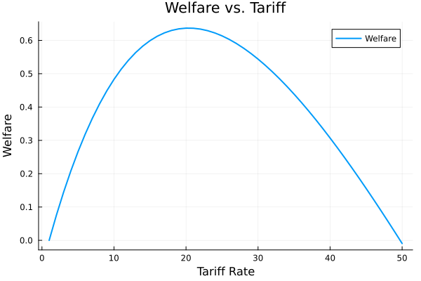

# Minnesota PhD Trade 2025

   

This Mike's course site and repository for his part of the University of Minnesota Course Econ 8403 (part of the Phd Trade Sequence) which is co-taught with Doireann Fitzgerald.

Time and place: 9:05-10:45 MW in Hanson Hall 4-190

---

### Why should you be interested in this course?

This course will focus on **trade policy** with a particular focus on quantitative aspects of trade policy. 

You'd have to be totally clueless to not realize trade policy is one of the most pressing issues today (second week of January 2025). The US (and the world) is embarking on one of the largest revisions of the world trading system in the past 80 years. This raises many questions of interest to the research community, policy makers, and general public. 

Now the theory of trade policy has seen some very important contributions. However, this aspect of the field has not kept up with the quantitative revolution in trade over the past 20 years. 

The goal is to learn the core theoretical contributions and then be able to think about magnitudes and areas for future investigation (especially on the measurement side).

---

### The plan

* **Monday 3rd February**: Detailed discussion of the [Eaton and Kortum (2002)](./readings/EK2002.pdf)  model. [Class notes](./notes/ek-notes.pdf) with detailed walk through as to how the model works. 

* **Wednesday 5th February**: We will have seen the equivalence between Eaton and Kortum and Armington. Then given demand system (Armington-CES), we will derive the optimal, unilateral tariff, in primal form. Readings are [Costinot, Rodriguez-Clare](./readings/CRC_Handbook.pdf) and [Dixit 1985](./readings/dixit-1985.pdf)

* **Monday 10th February**: Continue with optimal tariff in more general settings and quantitative implications.

* **Wednesday 12th February**: Political economy arguments for tariffs: [Grossman Helpman 1994](./readings/grossman-helpman.pdf).

* **Wednesday 26th February**: Redistributive motives [Adao, Costinot, Donaldson](https://www.nber.org/papers/w31798)

* **Monday 3rd March**: Quantitative analysis of trade wars: [Ossa 2014](./readings/ossa-2014.pdf)

* Class notes on [optimal tariffs](./notes/optimal-tariff-notes.pdf.pdf) the non-EK discussion above. 

---

### Deliverables

* [Problem Set](./problem-set/problem-set-waugh.pdf). Due April 1st. 

* Group presentation. This will be discussed jointly with Doireann and I 

---

### Code

* My julia code for the [Armington-CES model](https://github.com/mwaugh0328/julia-armington) and compute optimal tariffs.

* My julia replication of gravity regressions in [Eaton and Kortum (2002)](https://github.com/mwaugh0328/julia-eaton-kortum) and [Waugh (2010)](https://www.waugheconomics.com/uploads/2/2/5/6/22563786/sr435_itid.pdf) 

---

### Resources:

* Here is a comprehensive course that was taught by [Donaldson and Costinot](https://dave-donaldson.com/teaching/#tab-id-1). Lots of interesting stuff here.

* Treb Allen's (and Costas) their [notes](https://sites.google.com/site/treballen/graduate-trade).

* Gravity datasets are here at [CEPII](https://www.cepii.fr/CEPII/en/bdd_modele/bdd_modele.asp)

* [World input-output datasets](https://www.rug.nl/ggdc/valuechain/wiod/?lang=en) usefull to construct tradeflows across countries and industries.

  ---

  ### Papers related to topics that I'm covering

  **Capital Controls** Like with tariffs, imposing capital controls could move intertemporal prices in a countries favor

  * [Heathcote Perri](https://www.imf.org/external/np/res/seminars/2014/arc/pdf/heathcote_perri.pdf) quantiative BKK

  * [Costinot, Lorenzoni, Werning](https://economics.mit.edu/sites/default/files/publications/ITP_webpage.pdf)
 
  * [Optimal trade policy with trade imbalances](https://www.sciencedirect.com/science/article/abs/pii/S0304393219301990) by Beshkar and Shourideh
 
  **Revenue Maximization**

    * [Can Trade Taxes be a Major Source of Government Revenue?](https://alashkar.pages.iu.edu/TARIFF_REVENUE_Lashkaripour.pdf)
 
  **Distributional Concerns**

    * [Inequality, Redistribution and Optimal Trade Policy: A Public Finance Approach](https://roozbeh-hosseini.github.io/papers/Hosseini_Shourideh_Optimal_Trade_Policy.pdf)
   
    

